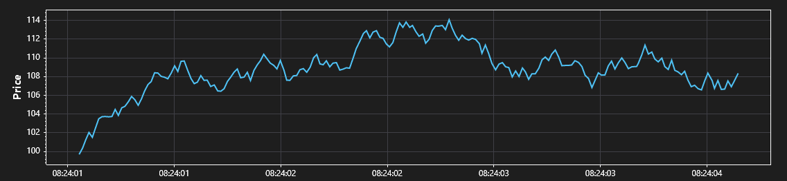

# UTS.AvaloniaUI.UserControlTask1

Разработка пользовательского TemplatedControl для Avaloni UI в виде отдельной библиотеки классов + Demo приложение для демонстрации работы.

## 🔧 Разработка

### Требуемые фреймворки и Nuget пакеты

- .NET 8.0 SDK
- Avalonia UI v11.3.6
- Avalonia.ReactiveUI v11.3.6
- ScottPlot v5.0.56
- xUnit v2.9.3

### Пример реализации пользовательского компонента TickChart

